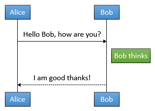

# cs-sequence-diagrams
Generates UML sequence diagrams from simple text.

## Example
We turn

    Alice->Bob: Hello Bob, how are you?
    Note right of Bob: Bob thinks
    Bob-->Alice: I am good thanks!

into



## Usage

You can use the sequence diagram in a C# application by making a Xaml file like this.

```xaml
<uml:SequenceDiagram DataContext="{Binding Text, Converter={StaticResource StringToSequenceDiagramConverter}, Mode=OneWay}" />
```

## Related

* [js-sequence-diagrams](https://bramp.github.io/js-sequence-diagrams/) Javascript version that this library was ported from.
* [Web Sequence Diagrams](http://www.websequencediagrams.com/) Server side version with a commercial offering
* [flowchart.js](https://adrai.github.io/flowchart.js/) A similar project that draws flow charts in the browser
